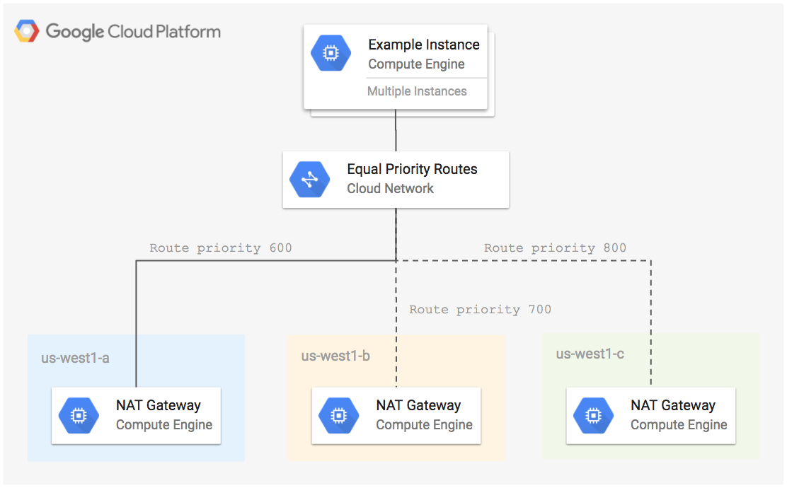

# Highly Available NAT Gateway Example

This example creates a NAT gateway in 3 Compute Engine zones within the same region. Failover between instances is achieved using [different priority routes](https://cloud.google.com/solutions/best-practices-floating-ip-addresses#option_3_failover_using_different_priority_routes) to the same instance tag.

**Figure 1.** *diagram of Google Cloud resources*



## Setup Environment

```
gcloud auth application-default login
export GOOGLE_PROJECT=$(gcloud config get-value project)
```

## Run Terraform

```
terraform init
terraform plan
terraform apply
```

SSH into the instance by hopping through the NAT gateway instance in us-west1-c (lowest priority route).

```
ssh-add ~/.ssh/google_compute_engine
gcloud compute ssh $(gcloud compute instances list --filter=name~nat-gateway-us-west1-c --limit=1 --uri) --ssh-flag="-A" -- ssh $(gcloud compute instances list --filter=name~group1- --limit=1 --format='value(name)')
```

Check the external IP of the instance:

```
curl http://ipinfo.io/ip
```

Repeat the command above a few times and notice that it cycles between the external IP of the NAT gateway instances.

## Cleanup

Remove all resources created by terraform:

```
terraform destroy
```